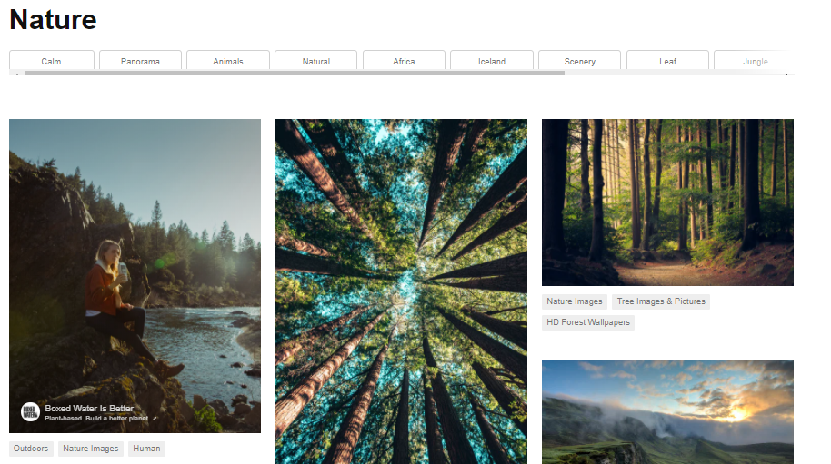

# Projects
A list of the projects I have worked on so far

### My Own Projects:

#### Project 1 - [Script to Automatically Download and Set Desktop Wallpaper](https://github.com/MaxvanderWerf/Unsplash_IMG_Downloader) (July 2020)
* Written a script that automatically downloads and sets a new desktop wallpaper for me everyday
* Using Selenium, the script opens Unsplash.com and searches for wallpapers by randomly selecting a searchterm from a list to add some variety
* The script then downloads the images using the selected searchterm (such as 'Nature' or 'Utrecht') 
* Finally, the script sets one of the downloaded images as my desktop background 
* Using a batch file and Windows Task Manager, this script is automatically executed daily 

#### Project 2 - [Kaggle Competition - Titanic](https://www.kaggle.com/c/titanic) (June 2020)

#### Project 3 - [Kaggle Competition - Housing Price Data](https://www.kaggle.com/c/home-data-for-ml-course/overview) (June 2020)
* Machine learning project with the goal of predicting house prices
* Final submission: Pipeline with XGBoost Regressor, Cross-Validation and One-Hot-Encoding
* (Top ~8% of all submissions)

### School Projects:
Work in progress
